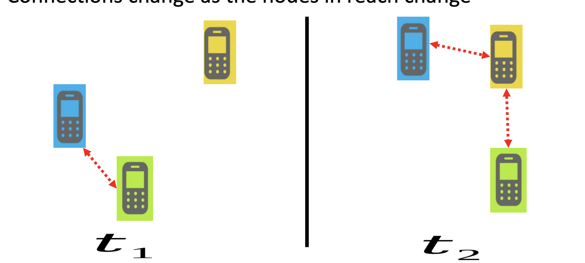
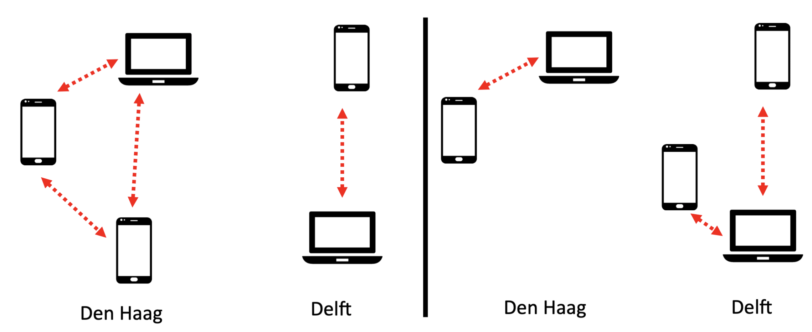

# Ad-hoc Network
* Decentralized wireless network
* Does not rely on any pre-existing infrastructure

## Wireless Sensor Network (WSN)
> Small devices with sensors that need to communicate their measurements
* eg. weather monitoring
* **Challenge**: restricted computation power & battery

## Wireless Mesh Network (WMN)
* Ad-hoc network extending internet to regions hard to reach
* Differentation in mesh clients, routers, gateways

## Mobile Ad-hoc Network (MANET)
* Mobile nodes
* Connection changes as nodes in reach change

## Vehicular Ad-hoc Network (VANET)
* Mobile nodes are vehicles
* **Challenge**: Fast reaction time
* Made easier by clear restrictions on mobility (eg cars stay on roads)

## Delay Tolerant Network (DTN)
Parts of the network that are not currently connected, can be connected in a later time

