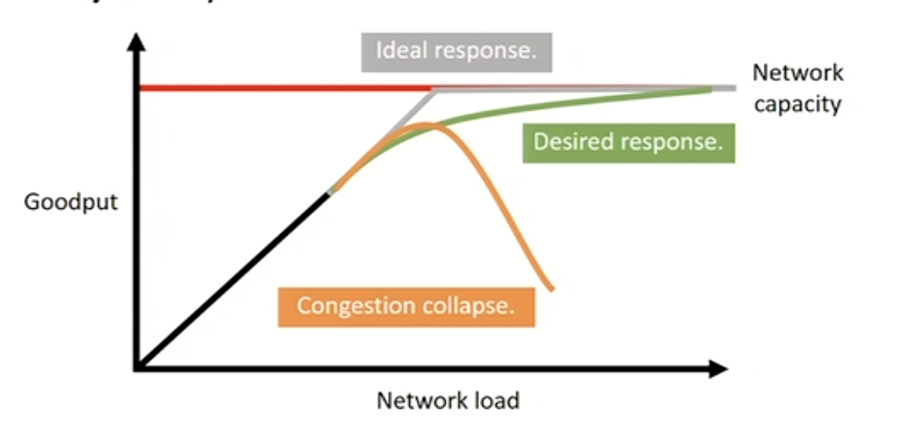
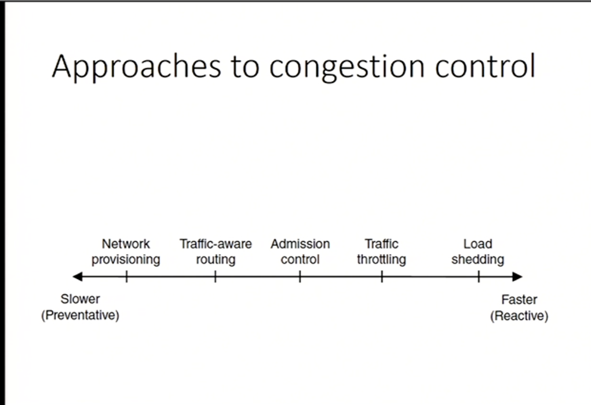
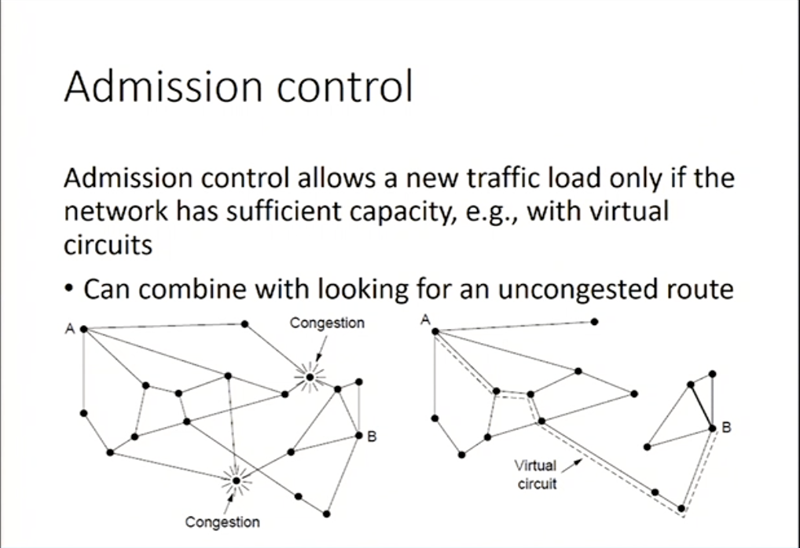

# Congestion Control
Combined responsibility of the network & transport layers

> Goodput: rate of useful packets arriving at the receiver

 

## Approaches
 

___

### Increasing Bandwidth 
Literally installing more cables and fibers

### Traffic aware routing
Choose routes depending on traffic not just topology
* Use EI for West to East traffic if CF is loaded
* Take create to avoid oscillations

### Admission control
If there is congestion, new traffic has to wait.
* use virtual circuits
 

### Traffic throttling
Send messages in the opposite direction to explicitly indicate network congestion.
* Set special bits in IP packet
* Inform sender of congestion through TCP

##### End to End
* send back a `choke` signal, which propogates back to the source of transmission. When the source receives this packet, it slows down transmission.
* its a bit slow

##### Link by Link 
* send back a `choke` signal, which propogates back to the source of transmission. Every router that receives this packet slows down transmission
* each router needs some buffering, we cant have fast incoming traffic when the output is slow. Every node has to coordinate 

### Load shedding
Throw some packets away for the greater good

1. Its easy to implement
2. Wired links are reliable
3. Packet loss likely caused by congestion

###### Packet loss can be interpreted as congestion

##### Random Early Detection (RED)
* Drop packets randomly if buffer space is almost full
* Sends an implicit signal to the sender: **slow down**

