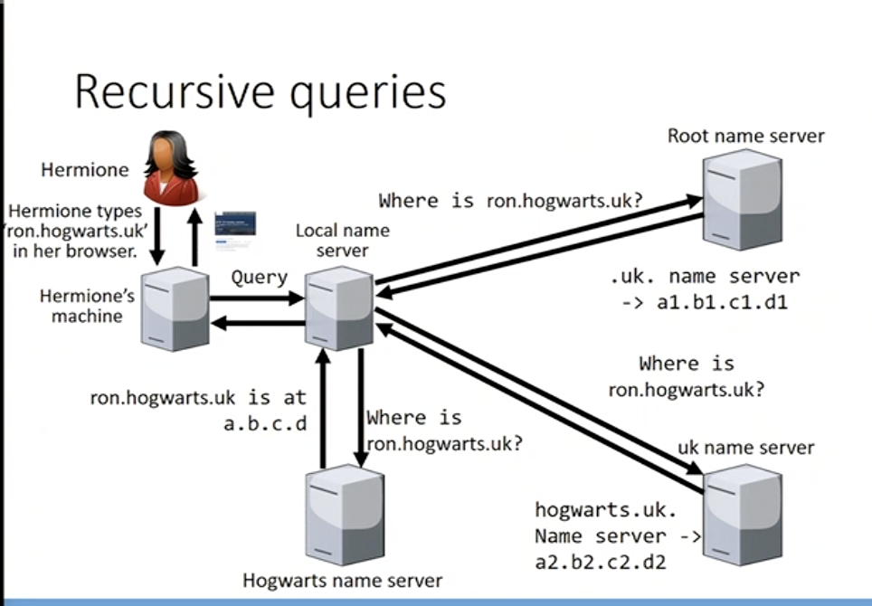
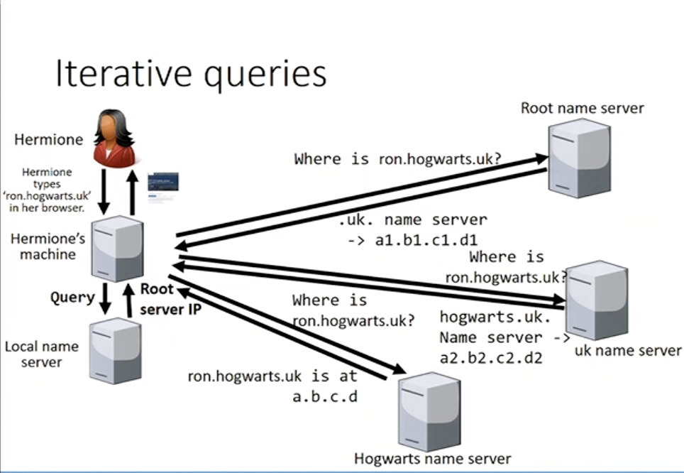

# Domain Name System

* DNS translates human readable names to IP addresses

## DNS name space
* **Hierarchical** structure.
* If you control a domain, you can specify arbitary subdomains

## Name Servers
* Translate a domain to an IP
* Location of name servers configured via DHCP
* The operating system keeps track of name servers & dynamically selects which one to use

## Queries
### Recursive Queries

### Iterative Queries

> Every endpoint in the schema using caching to save computing power

## Domain resource records
* Name servers reply with domain resource records, containing
	1. IPv4 address (record type A)
	2. IPv6 address (record type AAAA)
	3. Domain that accpets email (record type MX)
	4. Name server for this domain (record type NS)
