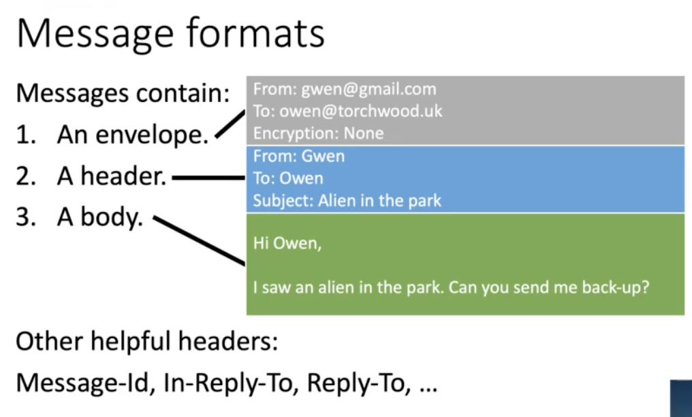

# Email
> 150 million emails sent every minute, 9/10 are spam lol

## Message formats

## How does it work?
1. Users use POP3 or IMAP to interact with their mailbox
2. Users & Message Transfer Agents use SMTP to send email from a source to a destination

## Interent Message Access Protocl (IMAP)
Sends commands to mail server to manipulate mailboxes
* LOGIN
* FETCH (fetch from folder)
* CREATE/DELETE (create or delete folder)
* EXPUNGE (remove messages marked for deletion)

## Multipurpose Interent Mail Extensions (MIME)
* Additional headers introduced (egg Content-Type) to indicate type of data in message (text, images, video, multipart)

### Base64 to encode binary to ASCII
egg. 
binary: 01101101 01100101
base64: 011011 01011 0101`00`
ascii: bVU=

