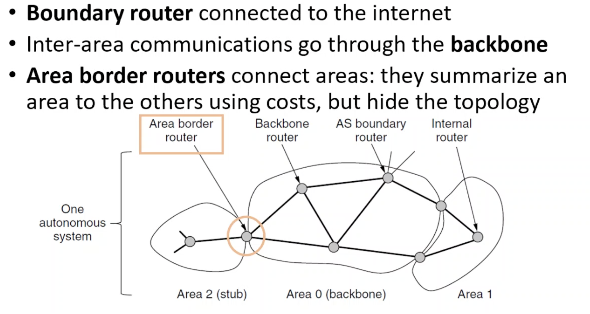
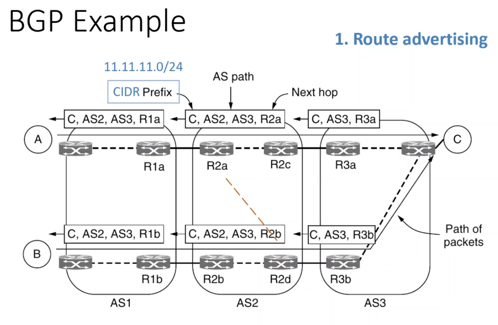

# Internet routing - gateway protocols

## Interior Gateway Protocols
#### egg. Open Shortest Path First (OSPF)
* Routing **within** a large Autonomous System (AS)
* A form of link state routing
* Builds a graph representation of the network
##### Properties
* Distance metrics
* Load balancing
* Dynamicity - adapts to changes in the topology
* Hierarchy - uses `areas` to manage large networks

## Exterior Gateway Protocol
#### egg. Border Gateway Protocol (BGP)
* Routing **between** large ASes.
* Supports **policies** of ISPs, companies or countries.

##### Autonomous systems
* are connected at Internet eXchange Points (IXPs)
* advertise (or not) routes to destinations to each other
* have transit or peering policies

* Uses a form of **distance vector routing**, combined with a path vector protocol

* A route to a destination is a next hop router and a list of ASes
* Routing costs are not communicated
* An AS chooses a route using its own policies
	

