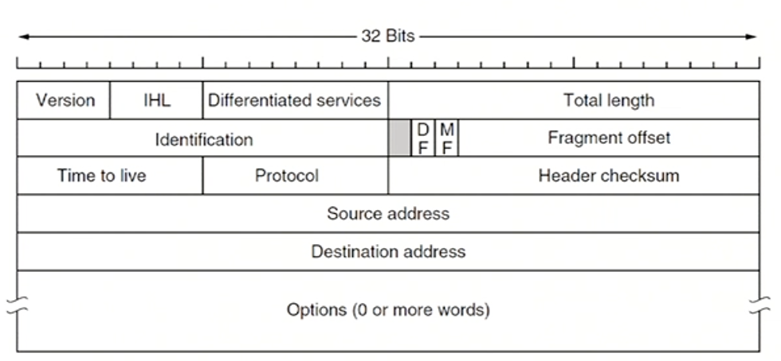
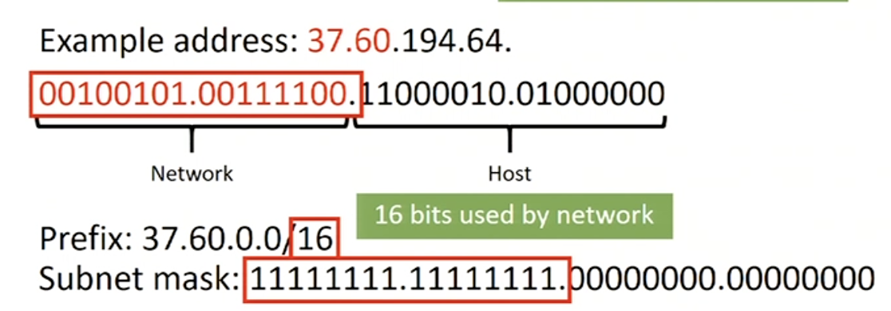
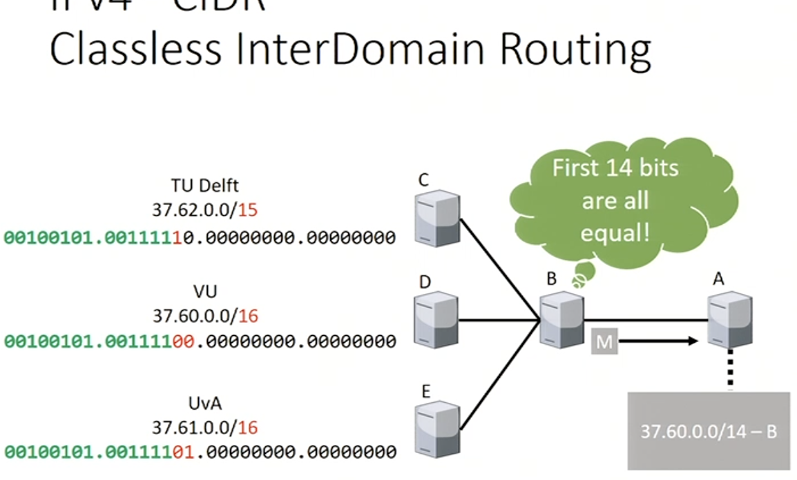
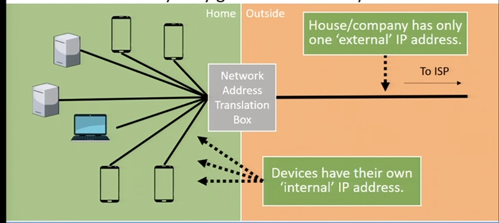
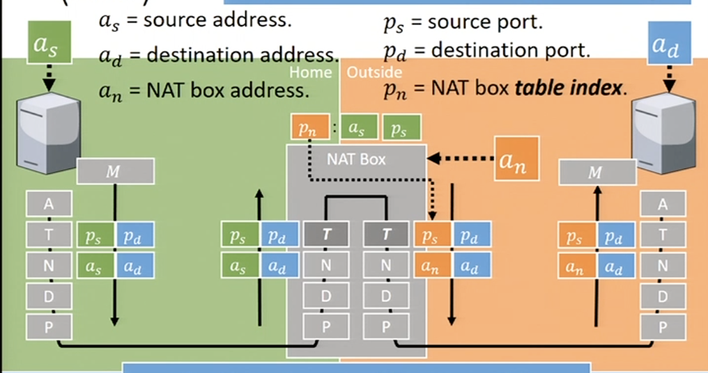
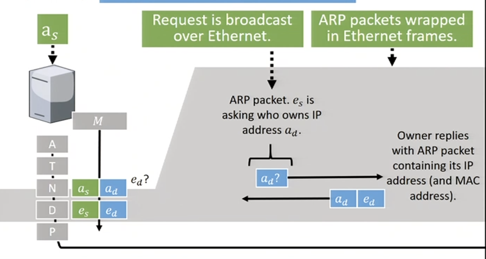
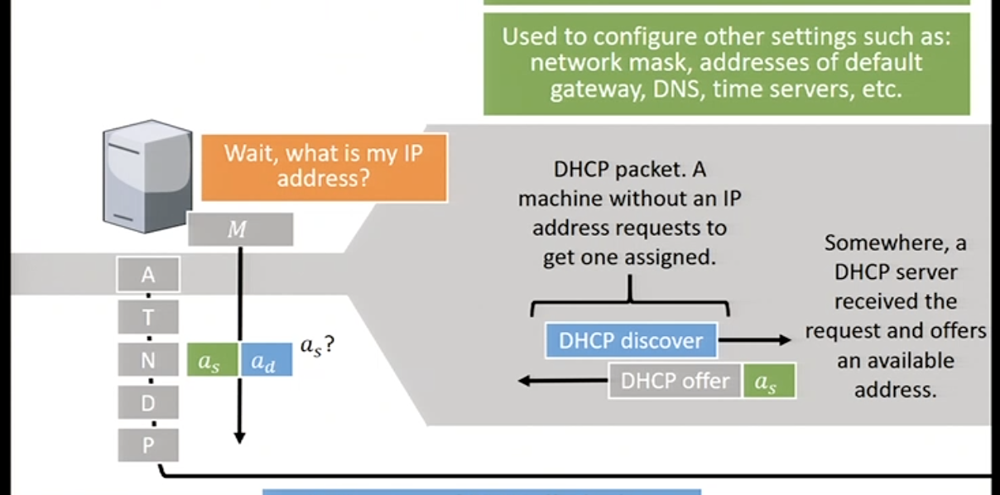

# Internet Protocols

## IP version 4 - IPv4

* 32-bit, 4 billion addresses
* written in dotted decimal notation (`0x80D00297` -> `128.208.2.151`)
* Time to live field in order to avoid infinite void loops in the network
* reduce routing table sizes using **hierarchical routing** 

eg. Address starts with 37.60? If yes route to TUD

## ClDR - Classless InterDomain Routing
* route aggregation technique group IPs that start the same & send them to a node to handle

## Network Address Translation (NAT)
* How to let everybody go online with only 2^32 addresses?
* Losing control, no oversight, no transparency

## IP version 6 - IPv6
1. Many more addresses
2. Simplified header - improves badnwidth/latency
3. Easier to add options in the header
4. Improved security support

* 128 bits
* Hexadecimal notation (`2001:0db8:85a3:0000:0000:8a2e:0370:7334`)

## Internet Control Message Protocol (ICMP)
If something goes wrong, routers send these messages to senders.
egg.
* Destination unreachable
* Time exceeded - *used by `traceroute*
* `Echo` and `echo reply` - *used by `ping`*
* Router advertisement/solicitation
	
## Address Resolution Protocol (ARP)

## Dynamic Host Configuration Protocol (DHCP)

