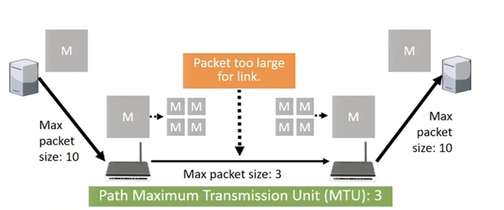

# Internetworking

> Sending packages end-to-end over multiple networks has a number of challenges

##### Networks...
1. may use different protocols
2. may offeer different QoS (Quality of Service) guarantees
3. Networks have different maximum packet sizes

## Tunneling
* If the source and destination networks use the same protocols we can use **tunneling**

### (Dis)Advantages
* Protocols need to be compatible, its limited
* QoS may differ??
* Part of the network is hidden

## Packet fragmentation
> Packet size needs to be limited in order to support older hardware. You can't just raise the minimum size of the pakets, huge networks that dont have enough money to upgrade are going to be cut off

### Transparent fragmentation
* Packet size can be limited by hardware, software, protocls, law, etc.
* Processing power, more complex, many problems come up, bit flips and error correction are way more complext

### Nontransparent fragmentation
* the message is not reconstructed in a router
* export the problem to the endpoint

## Avoiding packet fragmentation
### MTU discovery
* Refuse to transmit too large pakets, the source has to fragment the paket

