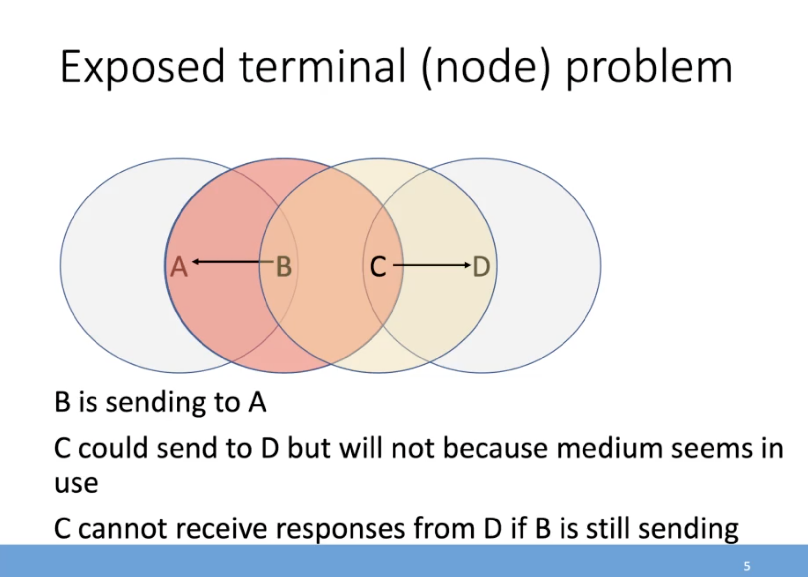
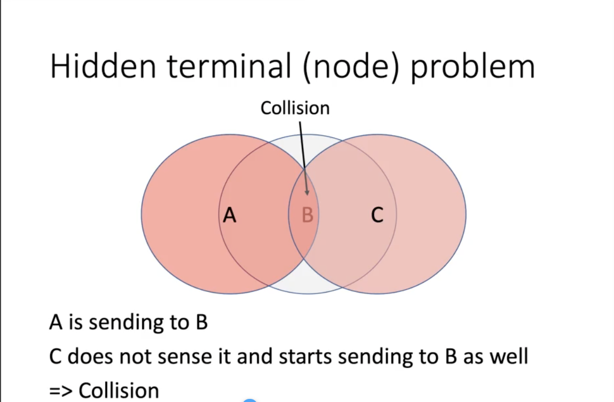

# MACA 

## Range
Terminals (stations for wireless networks) have a range. Their transmissions are only received by parties within the range

## Wireless & carrier-sense problems

## MACA to the fucking kind off rescue
> Multiple Access with collision avoidance
* Mitigatrs the above problems thru 2 extra messages

**Request to send (RTS)**
- Indicates terminal wants to send
- Includes sender & receiver **MAC** address

**Clear to send (CTS)**
- Indicates terminal is free to receive in response to a RTS
- Includes address of receiver of CTS (=terminal wanting to send)

The terminal sends a **RTS** and as response receives a **CTS**

---
- A wants to send to B
- A sends RTS
- B responds with CTS if its free
- A sens frame if it has received B's CTS
- B sends ACK for frame
- Any terminal receiving CTS for A does not send anything until it receives ACK (or max. delay)
- A backs off before sending another RTS if it does not receive CTS

