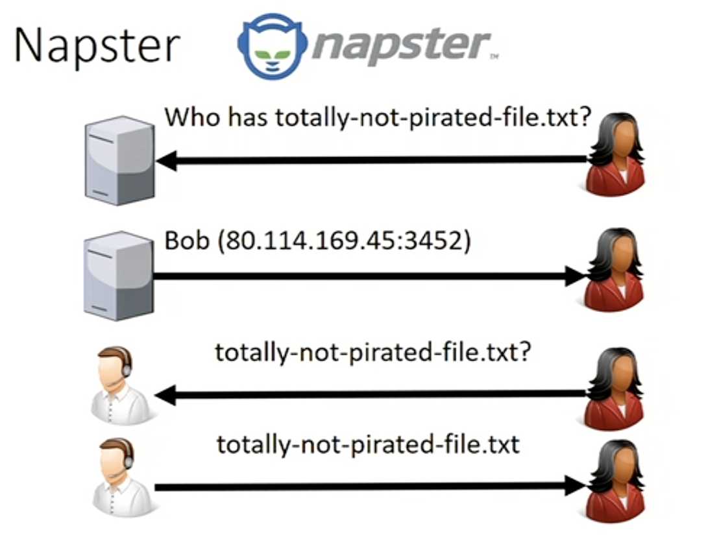
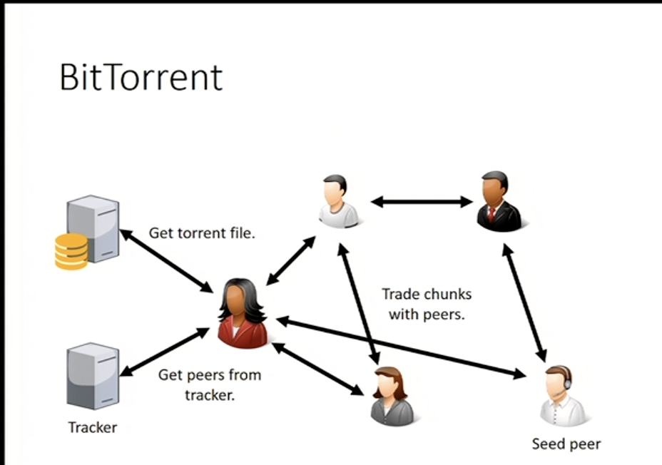
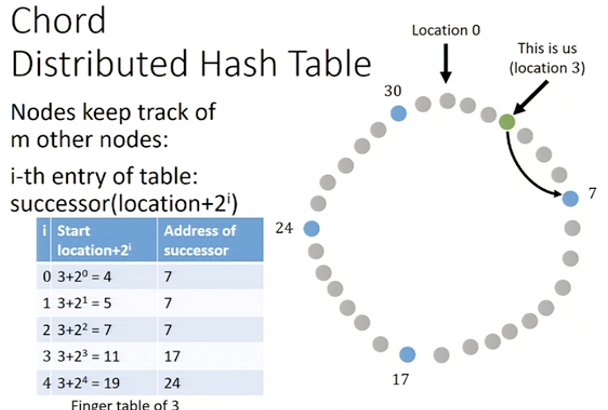

# Peer-to-peer systems
* Intead of relying on a central infrastructure, users can create their own insfrastructure by connecting to each other.

---

> it still has a centralized tracker

## Distributed Hash Tables (DHTs)
Distribute the information stored in the tracker over users.
#### Challenges:
1. Small amount of information to store per node
2. Quick look up
3. Concurrent use by all users

