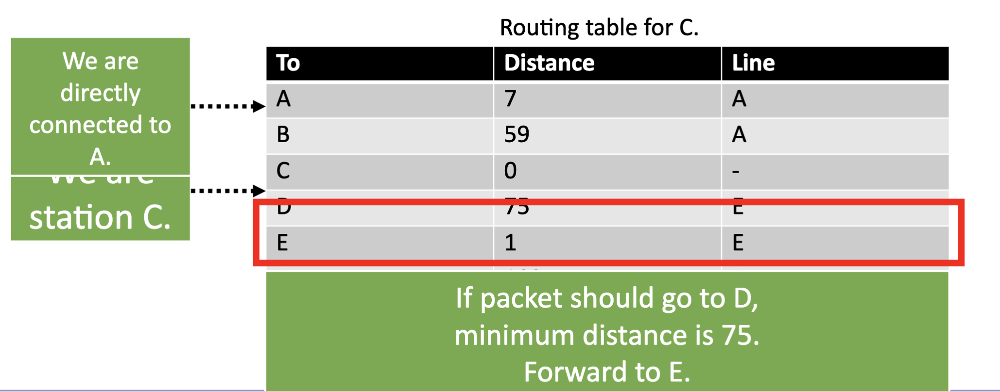
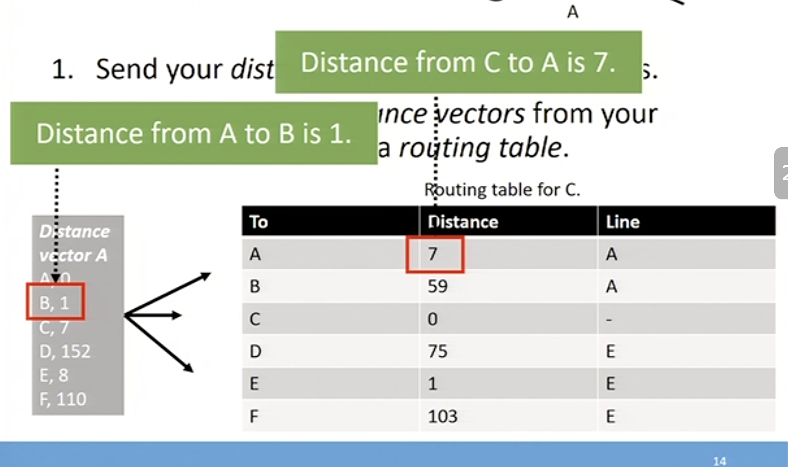
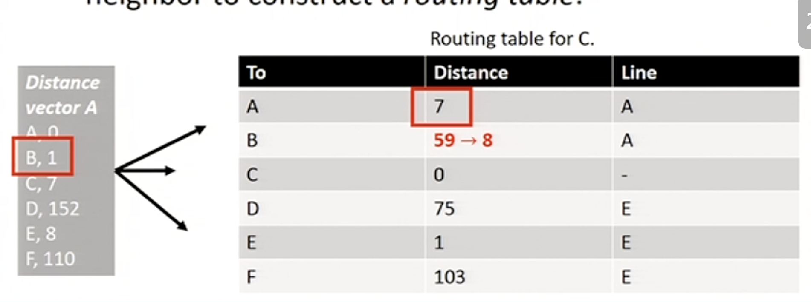
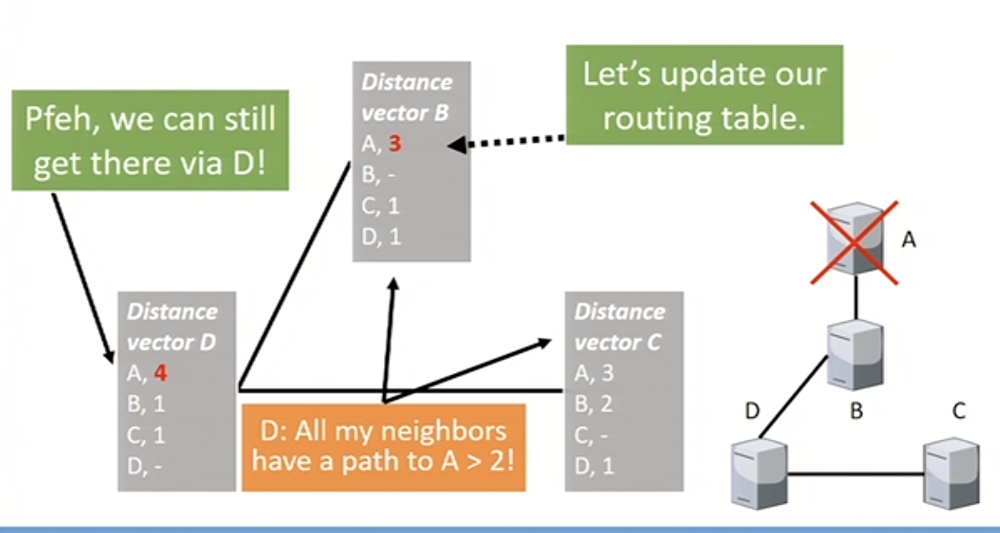
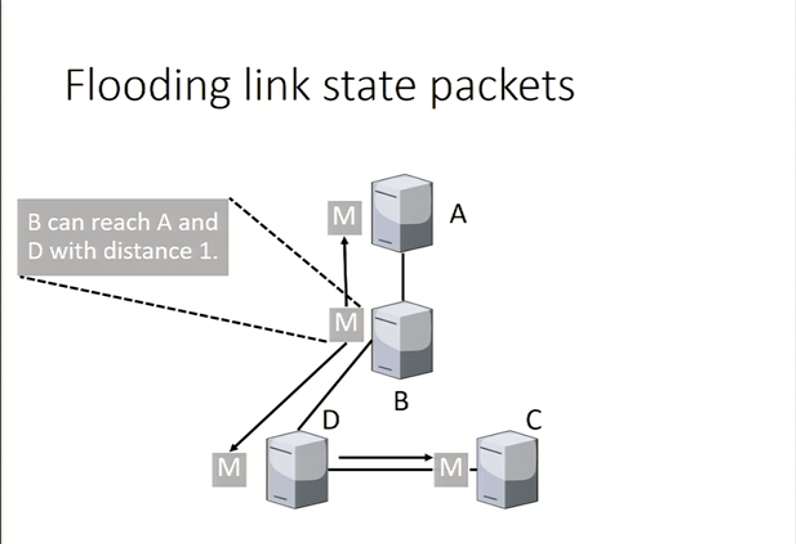
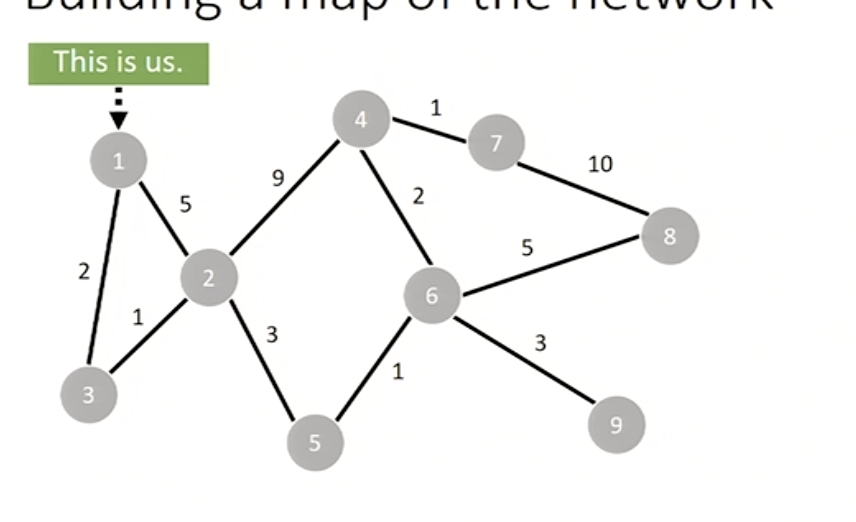
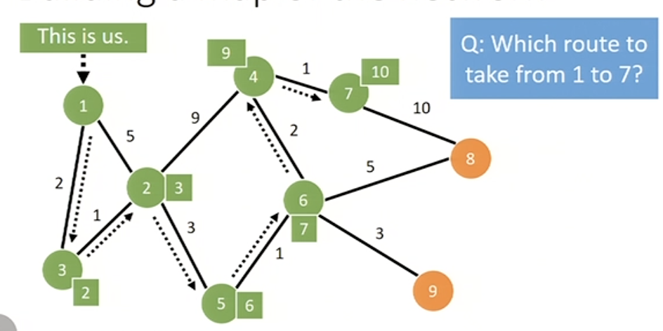
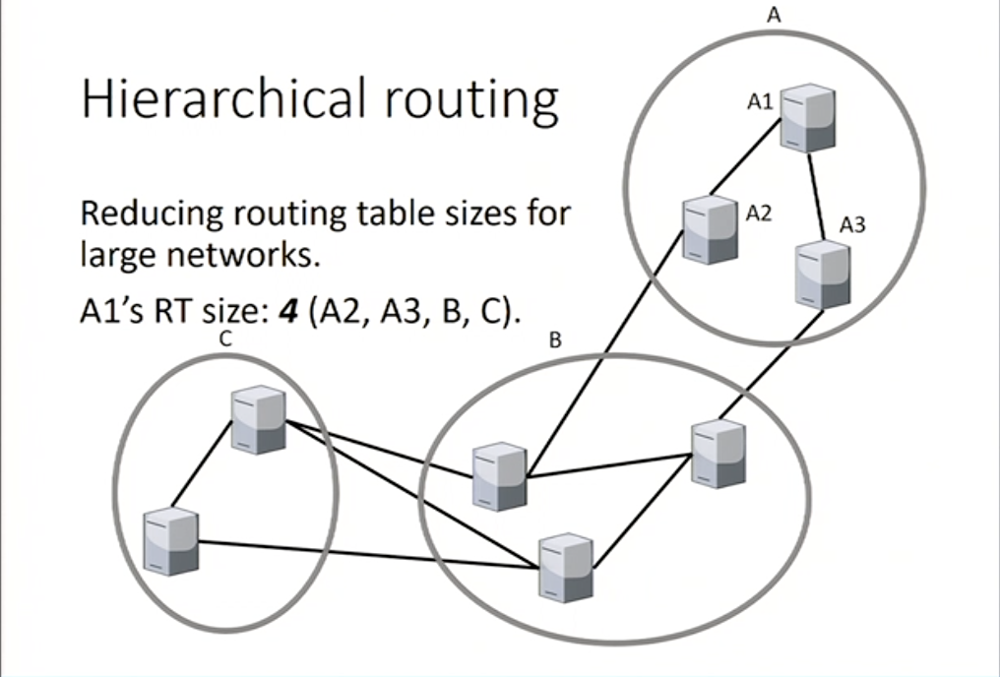

# Routing

## Key points of routing (properties)

1. Correctness 
2. Simplicity
3. Robustness
4. Stability
5. Fairness
6. Efficiency

## Optimality Principle
> If the best route C->A is through B, then B->A follows the same path
The collection of all best paths to a given destination forms a **tree**

# Algos to route packets
1. Distance vector routing
2. Link state routing
3. Hierarchical routing

## Routing tables
For every address, which link should you forward the packet to. 

> Routing table for C.

---
## Distance vector routing (DV)

1. Send your distance vector to your neighbors.
2. You use incoming distance vectors from your neighbour to construct a routing table

> Updating routing table

### Problem - Count to infinity

Happends when a node goes offline.

## Link state routing (LS)

* Does not suffer from the count to infinity problem, but itsmore complicated
* Uses a shortest path algorithm

1. Routers only send packets w/ information about their direct neighbors
2. These packets flooded over the network
3. Routers build an overview of the network using these packets and run a shortest path algorithm

#### Problems
* Old packets can overtake new packets and confuse the routing tables
* Using sequence numbers:
	* you never know which number is the latest one
	* one bit flip away form chaos
	

##### Building the map

##### Cost

##### Shortest path ( using Dijkstra's algorithm)

## Hierarchical routing
* Reducing routing table size for large networks.

