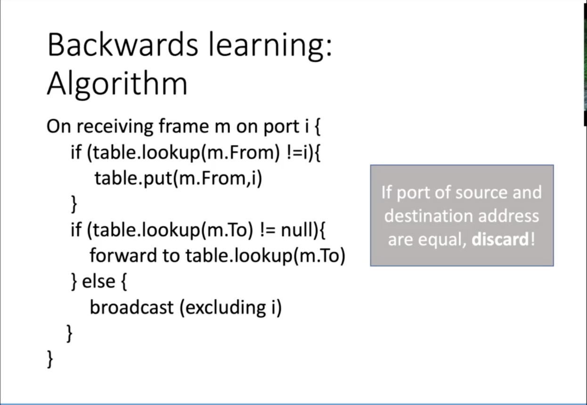
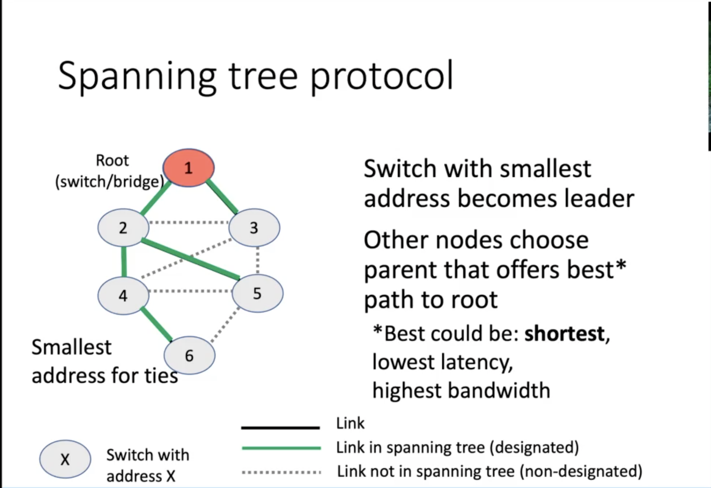
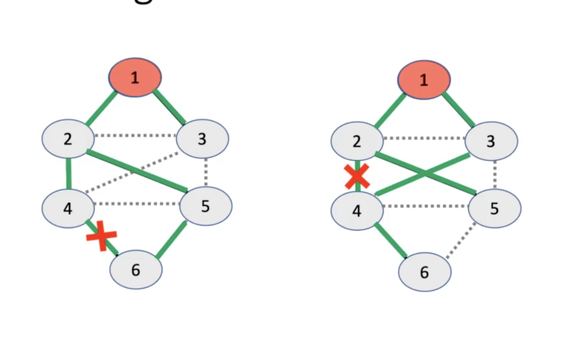

# Swithcing

## Hubs
> make all cables act as one, on the physical layer
* Device connection multiple Ethernet devices
* Has i/o ports
* Signal at one port goes to all other ports

## Switch (bridge)
> on the data link layer
* Use MAC addresses to fwd frames between machines such that frame only delivered to intended destination
* Frames have source & destination information
* Switch keeps a hash table that maps addresses to port numbers
**keeps also track of last time seen**

## Spanning tree protocol
> use extra cables to be safe

#### Reacting to failures

