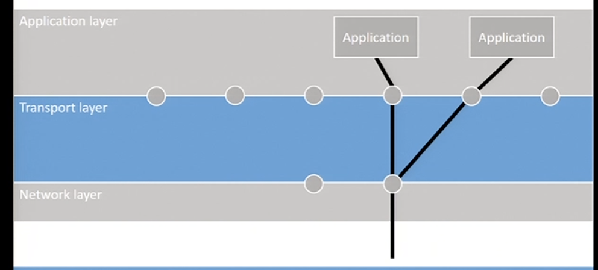

# Transport Layer
* provides host-to-host communication services for applications
* provides services such as 
	* connection-oriented communication
	* reliability (succesfull or not transmission)
	* flow control (manage the rate of data transmission between nodes)
	* multiplexing

---

> TSAP = Transport Service Access Point
> NSAP = Network Service Access Point

**Internet uses IPs for NSAPs and ports for TSAPs**

*The transport layer links the port to the IP,
aka. the TSAP to the NSAP*

## Primitives used to offer this service
1. **Listen** - wait for another process to contact us
2. **Connect** - connect to a process that is listening
3. **Send** - `send data` over the established connection
4. **Receive** - `receive data` over the established connection
5. **Disconnect** - release the connection

## Berkeley Socket primitives
> Used by TCP
1. **Socket** - create a new communication endpoint
2. **Bind** - assign a local address to the socket 
3. **Listen** - wait for another process to contact us
4. **Accept** - passively accept an incoming connection request
5. **Connect** - connect to a process that is listening
6. **Send** - `send data` over the established connection
7. **Receive** - `receive data` over the established connection
8. **Close** - release the connection

## Process servers
* a process server sees that a connection is incoming thru the transport layer, and from the header it knows its an email. Then it will start the email server to handle that message and close it off when done
* needs to be a mapping between the port & the application

## Multiplexing 
#### Multiple transport connections over one network connection

> there's always the concept of inverse multiplexing, one transport connection over multiple network connections (for this to work you need a machine that can hold multiple connections open)

