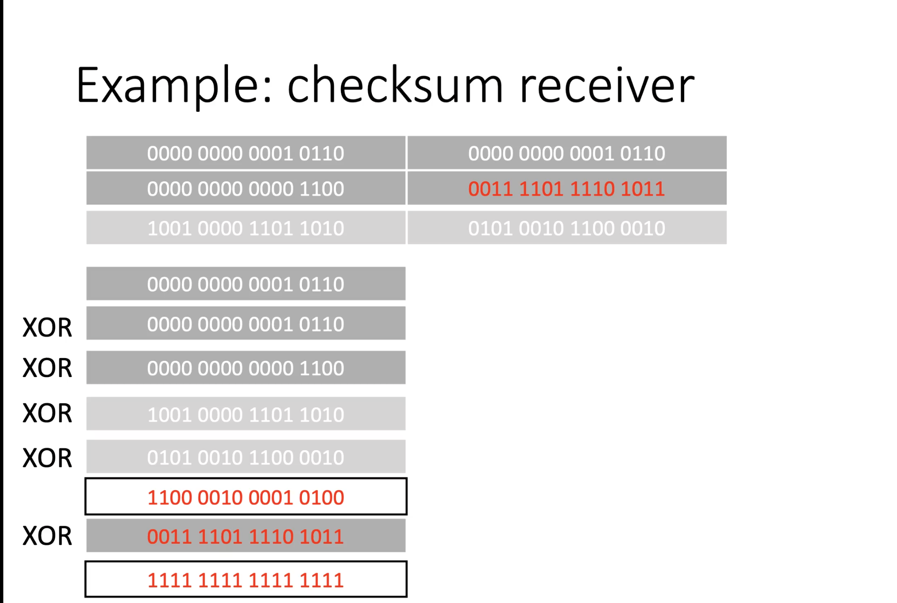
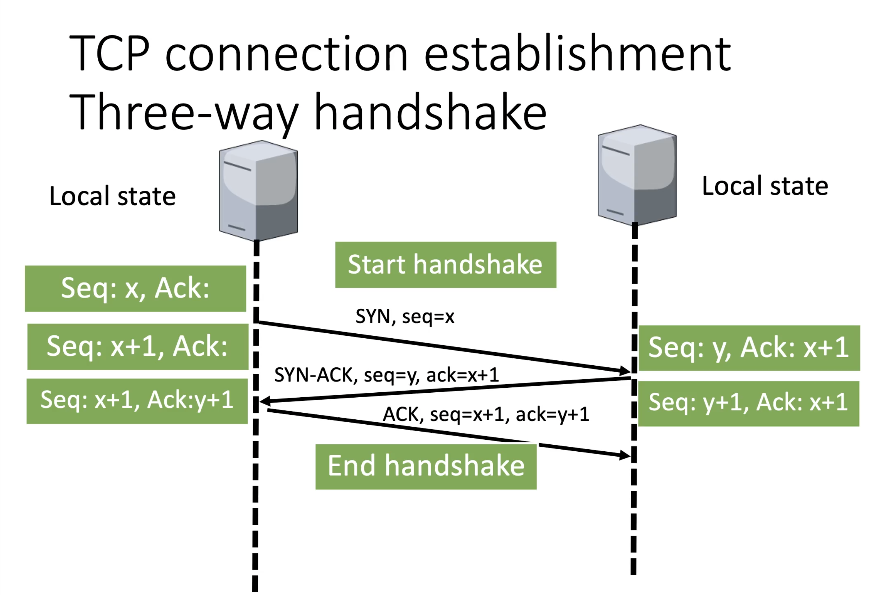
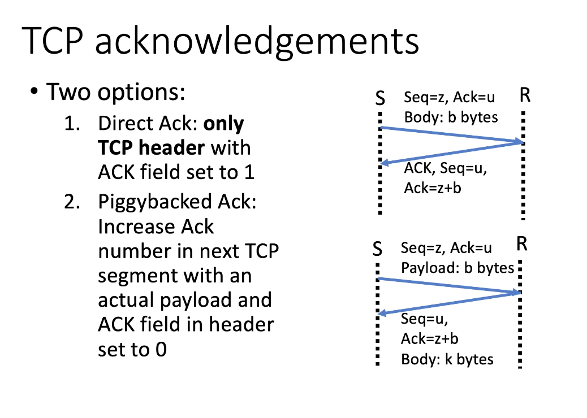

# Transport Layer
* provides host-to-host communication services for applications
* provides services such as 
	* connection-oriented communication
	* reliability (succesfull or not transmission)
	* flow control (manage the rate of data transmission between nodes)
	* multiplexing

---

> TSAP = Transport Service Access Point
> NSAP = Network Service Access Point

**Internet uses IPs for NSAPs and ports for TSAPs**

*The transport layer links the port to the IP,
aka. the TSAP to the NSAP*

## Primitives used to offer this service
1. **Listen** - wait for another process to contact us
2. **Connect** - connect to a process that is listening
3. **Send** - `send data` over the established connection
4. **Receive** - `receive data` over the established connection
5. **Disconnect** - release the connection

## Berkeley Socket primitives
> Used by TCP
1. **Socket** - create a new communication endpoint
2. **Bind** - assign a local address to the socket 
3. **Listen** - wait for another process to contact us
4. **Accept** - passively accept an incoming connection request
5. **Connect** - connect to a process that is listening
6. **Send** - `send data` over the established connection
7. **Receive** - `receive data` over the established connection
8. **Close** - release the connection

## Process servers
* a process server sees that a connection is incoming thru the transport layer, and from the header it knows its an email. Then it will start the email server to handle that message and close it off when done
* needs to be a mapping between the port & the application

## Multiplexing 
#### Multiple transport connections over one network connection

> there's always the concept of inverse multiplexing, one transport connection over multiple network connections (for this to work you need a machine that can hold multiple connections open)

## Transport Layer Headers

### UDP - User Datagram Protocol

* Very thin layer on top of IP. Header provides ports needed to connect to remote applications

* Allthough it has a checksum, UDP does not automatically re-transmit
* Applications can use the checksum to trigger retransmission

### TCP - Transmission Control Protocol
* Provides a reliable end-to-end byte stream over an unreliable network
* It has:
	* Error detection
	* Automatic retransmission
	* Flow control
	* Congestion control

### UDP vs TCP
> RFC - request for comment are published by the interent engineering task force (IETF) lol wtf

##### UDP is RFC 768
##### TCP has multiple RFCs, w/ an overview in RFC 4614

* TCP is connection oriented, thus for each TCP connection, local state consists of 
	* Next sequence number to use
	* Next acknoweledgement number to use
	* Congestion window
	* Timers for retransmission

* TCP also has a header length, because TCP header also supports optional options.

## TCP/UDP checksum
* Allthough we do some error correction in the data link layer, there are several error sources:
	* Routers
		* Drop packets due to congestion or misfunction
		* Flip bits at router rather than during transmission
	* Data link layer
		* Error detection/correction misses some errors

### 16-bit ones' complement
#### Sender
1. Divide data (egg, other header fields & body into 16-bit words)
2. Compute bitwise XOR over all words
3. Take ones' complement of result (egg. flip all bits)

#### Receiver
1. Divide header including checksum & body into 16-bit words
2. Compute bitwise XOR over all words
3. If not all bits in result are 1, there was an error

## Message Types
#### SYN
* connection establishment
* doesnt have a body
#### ACK
* acknowledgement
* doesnt have a body
#### FIN
* connection termination
* doesnt have a body

	
## Sequence Numbers
* **used to find lost data**
* implemented on TCP
* each party has a local state, telling them which acknoweledgemnt & sequence number to use next

### Purposes
* Used to detect:
	* missing segments - **data link layer issue**
	* segments arrive out of order 
	* parts of segments are missing
	* duplicates

	
---

* before sending SYN: choose initial sequence number
* when receiving SYN: choose initial sequence number
* every data byte adds 1 to the sequence number
* SYN & FIN also add 1 to the sequence number
* ACKs do not increase sequence numbers
* if sequence/ack numbers in messages do not match locally stored ones: retransmit

#### Generate next sequence number
= inital own sequence number + number of previously sent bytes

#### Generate next Acknowledgement number
= inital sequence number of communication partner + number of previously received bytes

## TCP connection establishment
### Three-way handshake

## TCP acknowledgements

1. Direct ACK: only TCP header with ACK field set to 1
2. Piggybacked ACK: Increase ACK number in next TCP segment with an actual payload & ACK field in header set to 0

